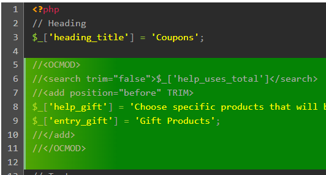
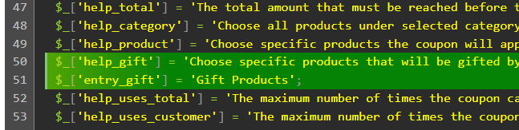

## English
**OCMod builder** is a tool designed to facilitate the creation of modification files for OpenCart, which is otherwise a cumbersome task.

This tool was developed from the code shared at: https://tech-en.netlify.app/articles/en529186/index.html. I would like to thank its author for his valuable contribution.

The main advantage of **OCMod builder** is that it allows you to write changes directly into the code of OpenCart files, whether PHP, Javascript or Twig. The changes are made in a copy of OpenCart to avoid altering the original files.

### Prepare the environment

- Place the **OCMod builder** files in a folder on your local web server, for example www/ocmod-builder if you are using Wamp.
- Edit the **ocmod-builder.cfg.php** file and update the constant values according to your environment and the output data in the **install.xml** file.
- Open the browser and click on the **Restore OpenCart Copy** button, this will create a copy of the OpenCart files in the folder set in the ROOT_PATH constant.
- Start your IDE and open as a project the folder configured in the ROOT_PATH constant, which contains the copy of OpenCart you will be working with.
- Add the following templates to your IDE (in PhpStorm you will need to open $Settings/Editor/Live templates$ to add them and use Ctrl + J to insert them).

  **PHP** y **Javascript**

  //&lt;OCMOD&gt;
   
  //&lt;search trim="false"&gt;\$SEARCH\$&lt;/search&gt;
   
  //&lt;add position="\$POSITION\$" TRIM&gt;
   
  \$ADD\$  
  //&lt;/add&gt;
   
  //&lt;/OCMOD&gt;

  **Twig**
  {#&lt;OCMOD&gt;#} 
  {#&lt;search>\$SEARCH\$&lt;/search&gt;#} 
  {#&lt;add position="\$before\$" TRIM&gt;#} 
  \$CODE\$ 
  {#&lt;/add&gt;#} 
  {#&lt;/OCMOD&gt;#}

  Values between \$ are used in PhpStorm to set the texts you can edit when inserting the template. You may need to adjust the template if you use another IDE.

### Writing code

Open the file you need to modify and insert the template where the change needs to be made. Make the relevant changes in the &lt;search&gt; and &lt;add&gt; tags and write inside the latter the code you need to add.

Inside the &lt;add&gt; tag you can use the following "attributes" to perform some actions before inserting the code into the XML (install.xml). Note that they must be written in uppercase.

- TRIM, LTRIM and RTRIM apply the same PHP function (trim, ltrim and rtrim) to the content of the <add> tag.
- APPEND="xxx" Adds the value in quotes to the end of the content of &lt;add&gt;. For example: APPEND="$1", if you use regex="true" and you want to add \$1 at the end inside PHP code (the IDE would show this as an error).
  -PREPEND="xxx" Does the same thing as append, but adds it to the beginning of the contents of &lt;add&gt;.

You can add new files inside the folders of your OpenCart copy, **OCMod builder** will detect them and include them in the **upload** folder when generating the .zip and will update the $\$upload$ variable in the **ocmod-builder.cfg.php** file with the list of new files found. The same will happen if you delete any of these files.

#### Example:

## Español
**OCMod builder** es una herramienta pensada para facilitar la creación de archivos de modificación para OpenCart, que de otra forma es una tarea engorrosa.

Esta herramienta fue desarrollada a partir del código compartido en: https://tech-en.netlify.app/articles/en529186/index.html. Se agradece a su autor por su valioso aporte.

La principal ventaja de **OCMod builder** es la de permitir escribir los cambios directamente en el código de los archivos de OpenCart, ya sea PHP, Javascript o Twig. Los cambios se realizan en una copia de OpenCart para no alterar los archivos originales.

### Preparar el entorno

- Coloque los archivos de **OCMod builder** en una carpeta de su servidor web local, por ejemplo, www/ocmod-builder si utiliza Wamp.
- Edite el archivo **ocmod-builder.cfg.php** y actualice los valores de las constantes de acuerdo a su entorno y los datos de salida del archivo **install.xml**.
- Abra el navegador y haga clic en el botón **Restaurar copia de OpenCart**, esto creará una copia de los archivos de OpenCart en la carpeta configurada en la constante ROOT_PATH.
- Inicie su IDE y abra como proyecto la carpeta configurada en la constante ROOT_PATH, que contiene la copia de OpenCart con la que trabajará.
- Agregue las siguientes plantillas en su IDE (en PhpStorm deberá abrir $Settings/Editor/Live templates$ para añadirlas y utilizar las teclas Ctrl + J para insertarlas).

  **PHP** y **Javascript**
  //&lt;OCMOD&gt;
   
  //&lt;search trim="false"&gt;\$SEARCH\$&lt;/search&gt;
   
  //&lt;add position="\$POSITION\$" TRIM&gt;
   
  \$ADD\$  
  //&lt;/add&gt;
   
  //&lt;/OCMOD&gt;

  **Twig**
  {#&lt;OCMOD&gt;#} 
  {#&lt;search>\$SEARCH\$&lt;/search&gt;#} 
  {#&lt;add position="\$before\$" TRIM&gt;#} 
  \$CODE\$ 
  {#&lt;/add&gt;#} 
  {#&lt;/OCMOD&gt;#}

  Los valores entre \$ se utilizan en PhpStorm para establecer los textos que puede editar al insertar la plantilla. Es posible que deba ajustar la plantilla si utiliza otro IDE.

### Escribiendo código

Abra el archivo que debe modificar e inserte la plantilla en el lugar donde debe hacerse el cambio. Haga los cambios pertinentes en las etiquetas &lt;search&gt; y &lt;add&gt; y escriba dentro de esta última el código que debe añadir.

Dentro de la etiqueta &lt;add&gt; puede utilizar los siguientes "atributos" para realizar algunas acciones antes de insertar el código en el XML (install.xml). Note que deben escribirse en mayúsculas.

- TRIM, LTRIM y RTRIM aplican la misma función de PHP (trim, ltrim y rtrim) al contenido de la etiqueta <add>.
- APPEND="xxx" Agrega el valor entre comillas al final del contenido de &lt;add&gt;. Por ejemplo: APPEND="$1", si se usa regex="true" y se desea añadir \$1 al final dentro de código PHP (el IDE lo mostraría como error).
  -PREPEND="xxx" Hace lo mismo que append, pero lo agrega al comienzo del contenido de &lt;add&gt;.

Puede agregar nuevos archivos dentro de las carpetas de la copia de OpenCart, **OCMod builder** los detectará y los incluirá en la carpeta **upload** al generar el .zip y actualizará la variable $\$upload$ en el archivo **ocmod-builder.cfg.php** con la lista de nuevos archivos encontrados. Lo mismo ocurrirá si elimina alguno de estos archivos.

#### Ejemplo:

